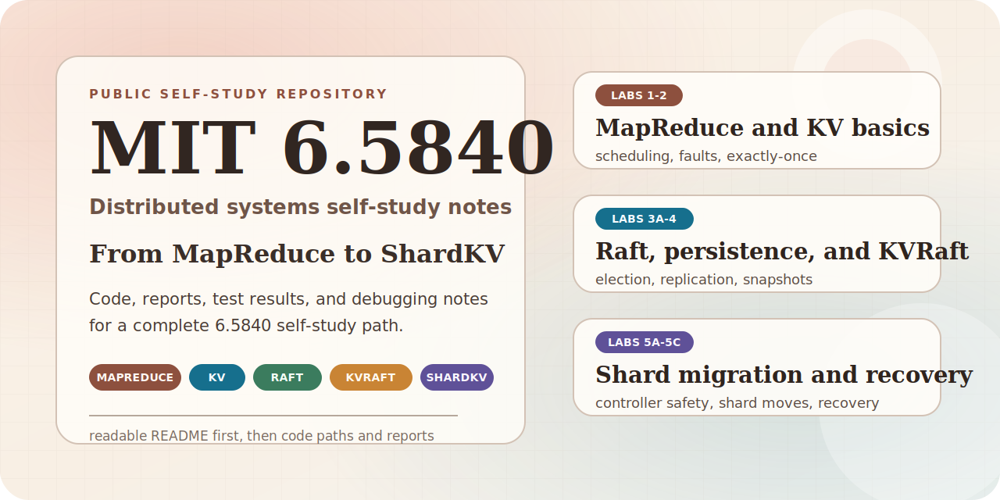
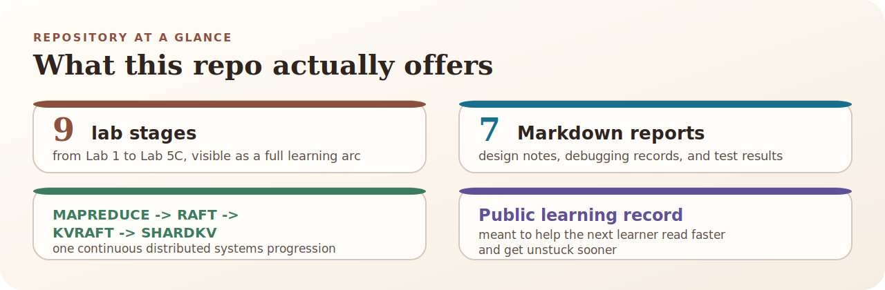
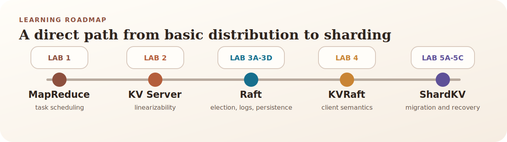

<p align="right">
  <a href="./README.zh-CN.md">中文</a> | <strong>English</strong>
</p>

# MIT 6.5840 Distributed Systems Self-Study Notes

<p align="center">
  
</p>

<p align="center">
  
  
  
  
  
</p>

> From MapReduce to ShardKV.  
> This repository keeps not only the code, but also design notes, test results, debugging records, and lessons learned along the way.

This repository documents my self-study journey through MIT 6.5840 Distributed Systems.

I benefited a lot from materials shared by others when I was learning this course, so I decided to open-source my own implementations, reports, and debugging notes in return. This repo is not meant to present a “perfect answer.” It is meant to help the next learner quickly understand the path, find the code, and see where each lab actually gets difficult.

<p align="center">
  
</p>

## Quick Navigation

- Want the overall status: see [Lab Overview](#lab-overview)
- Want the course progression first: see [Roadmap](#roadmap)
- Want the most useful reading entry points: see [Recommended Reads](#recommended-reads)
- Want to find code quickly: see [Repository Layout](#repository-layout) and [Version Notes](#version-notes)

## Roadmap

<p align="center">
  
</p>

## Lab Overview

| Lab | Topic | Status | Code | Report | Keywords |
| --- | --- | --- | --- | --- | --- |
| Lab 1 | MapReduce | ✅ Done | [src/mr](./src/mr) / [src/mrapps](./src/mrapps) | [lab1-report.md](./report/report/lab1-report.md) | scheduling, fault recovery, Coordinator/Worker |
| Lab 2 | Key/Value Server | ✅ Done | [src/kvsrv](./src/kvsrv) | [lab2-report.md](./report/report/lab2-report.md) | exactly-once, linearizability, duplicate requests |
| Lab 3A | Raft Leader Election | ✅ Done | [lec-2025/src/raft1](./lec-2025/src/raft1) | [lab3a-report.md](./report/report/lab3a-report.md) | election timeout, randomization, heartbeats |
| Lab 3B | Raft Log Replication | ✅ Done | [lec-2025/src/raft1](./lec-2025/src/raft1) | [lab3b-report.md](./report/report/lab3b-report.md) | replication, commit rules, conflict handling |
| Lab 3C / 3D | Raft Persistence / Snapshot | ✅ Done | [lec-2025/src/raft1](./lec-2025/src/raft1) | [lab3c&d-report.md](./report/report/lab3c&d-report.md) | persistence, snapshots, crash recovery |
| Lab 4 | KVRaft | ✅ Done | [lec-2025/src/kvraft1](./lec-2025/src/kvraft1) | [lab4-report.md](./report/report/lab4-report.md) | Clerk retries, ErrMaybe, snapshot integration |
| Lab 5A | ShardKV configuration and shard migration | ✅ Done | [lec-2025/src/shardkv1](./lec-2025/src/shardkv1) | [lab5-report.md](./report/report/lab5-report.md) | shard migration, freeze strategy, routing |
| Lab 5B | Controller fault tolerance and recovery | ✅ Done | [lec-2025/src/shardkv1](./lec-2025/src/shardkv1) | [lab5-report.md](./report/report/lab5-report.md) | controller recovery, config pre-save, idempotency |
| Lab 5C | Concurrent controllers and config numbering fixes | ✅ Done | [lec-2025/src/shardkv1](./lec-2025/src/shardkv1) | [lab5-report.md](./report/report/lab5-report.md) | concurrency, config numbering, leased leadership |

`Lab 5A / 5B / 5C` are currently documented in the same [lab5-report.md](./report/report/lab5-report.md).

## Recommended Reads

- Want to see why Raft is tricky to implement: read [lab3b-report.md](./report/report/lab3b-report.md), especially the parts on log matching, commit advancement, and easy-to-miss edge cases.
- Want to see how persistence and snapshots are implemented in practice: read [lab3c&d-report.md](./report/report/lab3c&d-report.md), which includes complete `go test -race` passing records and detailed crash-recovery/snapshot logic.
- Want to see how KVRaft deals with retries and state-machine consistency: read [lab4-report.md](./report/report/lab4-report.md), especially the sections on `ErrMaybe`, snapshot integration, and performance tuning.
- Want to see where ShardKV becomes genuinely hard: read [lab5-report.md](./report/report/lab5-report.md). Besides the design and test results for 5A/5B/5C, it also contains a long debugging and pitfall summary.

## Why This Repository Is Useful

- It is not a code dump. Each stage is paired with reports explaining design choices, debugging paths, and test outcomes.
- It keeps the traces of a real self-study process. You can see how problems surfaced, why they happened, and how they were fixed.
- It covers a full path from basic distributed task scheduling to consensus, replicated state machines, and shard migration.

## Repository Layout

```text
.
├── assets/
│   └── readme/      # SVG assets used by the README landing pages
├── report/
│   ├── report/      # Markdown reports for each lab
│   └── lab_web/     # Lab pages and related course materials
├── src/             # Early-stage lab code and original course layout
├── lec-2025/        # 2025-version course code and later lab implementations
└── README.md
```

## Version Notes

- `src/` mainly preserves the earlier-stage lab code and course structure, especially the entry points for `Lab 1` and `Lab 2`.
- `lec-2025/` mainly contains the later implementations and test environment, especially for `Raft`, `KVRaft`, and `ShardKV`.
- Since 6.5840 changes across course years, it is best to read the code together with the corresponding report instead of assuming too much from directory names alone.

## Notes

- The detailed reports linked above are primarily written in Chinese.
- This is not an official solution repository, and it is not meant to present a “best possible implementation.”
- If your course year or lab spec differs from this repository, always follow the official materials for your own version first.

If this repository helps you, feel free to use it. If you notice something inaccurate or poorly explained, feel free to point it out.
