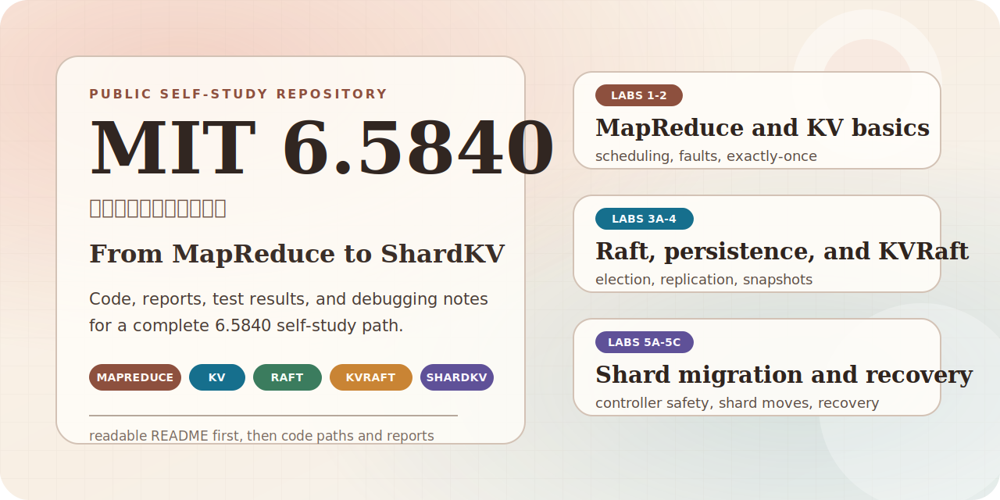

<p align="right">
  <strong>中文</strong> | <a href="./README.md">English</a>
</p>

# MIT 6.5840 （原 6.824）分布式系统 自学实验记录

<p align="center">
  
</p>

<p align="center">
  
  
  
  
  
</p>

> 从 MapReduce 到 ShardKV。  
> 这里不仅有代码，也尽量保留了实现思路、测试结果、调试过程和踩坑记录。

这个仓库记录了我自学 MIT 6.5840 Distributed Systems 的过程。

我在学习这门课时受过不少前人的帮助，所以决定把自己的实现、报告和调试经验公开出来。这个仓库不是为了“展示一份标准答案”，而是希望后来者点进来时，能快速看清楚学习路线、代码位置和每个实验真正难在哪里。

<p align="center">
  
</p>

## 快速入口

- 想总览实验进度：看 [实验进度总览](#实验进度总览)
- 想顺着课程路线看：看 [学习路线图](#学习路线图)
- 想直接读最有价值的内容：看 [精选阅读入口](#精选阅读入口)
- 想找代码位置：看 [仓库结构](#仓库结构) 和 [版本说明](#版本说明)

## 学习路线图

<p align="center">
  
</p>

## 实验进度总览

| Lab | 主题 | 状态 | 代码 | 报告 | 关键词 |
| --- | --- | --- | --- | --- | --- |
| Lab 1 | MapReduce | ✅ 完成 | [src/mr](./src/mr) / [src/mrapps](./src/mrapps) | [lab1-report.md](./report/report/lab1-report.md) | 任务调度、故障恢复、Coordinator/Worker |
| Lab 2 | Key/Value Server | ✅ 完成 | [src/kvsrv](./src/kvsrv) | [lab2-report.md](./report/report/lab2-report.md) | exactly-once、线性化、重复请求处理 |
| Lab 3A | Raft Leader Election | ✅ 完成 | [lec-2025/src/raft1](./lec-2025/src/raft1) | [lab3a-report.md](./report/report/lab3a-report.md) | 选举超时、随机化、心跳机制 |
| Lab 3B | Raft Log Replication | ✅ 完成 | [lec-2025/src/raft1](./lec-2025/src/raft1) | [lab3b-report.md](./report/report/lab3b-report.md) | 日志复制、提交规则、冲突处理 |
| Lab 3C / 3D | Raft Persistence / Snapshot | ✅ 完成 | [lec-2025/src/raft1](./lec-2025/src/raft1) | [lab3c&d-report.md](./report/report/lab3c&d-report.md) | 持久化、快照、崩溃恢复 |
| Lab 4 | KVRaft | ✅ 完成 | [lec-2025/src/kvraft1](./lec-2025/src/kvraft1) | [lab4-report.md](./report/report/lab4-report.md) | Clerk 重试、ErrMaybe、快照集成 |
| Lab 5A | ShardKV 配置管理与分片迁移 | ✅ 完成 | [lec-2025/src/shardkv1](./lec-2025/src/shardkv1) | [lab5-report.md](./report/report/lab5-report.md) | 分片迁移、冻结策略、路由更新 |
| Lab 5B | Controller 容错与恢复 | ✅ 完成 | [lec-2025/src/shardkv1](./lec-2025/src/shardkv1) | [lab5-report.md](./report/report/lab5-report.md) | controller 恢复、配置预保存、幂等性 |
| Lab 5C | 并发 Controller 与配置编号修复 | ✅ 完成 | [lec-2025/src/shardkv1](./lec-2025/src/shardkv1) | [lab5-report.md](./report/report/lab5-report.md) | 并发控制、配置编号、leased leadership |

`Lab 5A / 5B / 5C` 当前整理在同一份 [lab5-report.md](./report/report/lab5-report.md) 中。

## 精选阅读入口

- 想看 Raft 到底为什么会难写：读 [lab3b-report.md](./report/report/lab3b-report.md)，重点是日志匹配、提交推进和容易漏掉的边界条件。
- 想看持久化和快照怎么真正落地：读 [lab3c&d-report.md](./report/report/lab3c&d-report.md)，报告里包含 `go test -race` 的完整通过记录，以及崩溃恢复与快照安装的实现细节。
- 想看 KVRaft 如何处理客户端重试与状态机一致性：读 [lab4-report.md](./report/report/lab4-report.md)，里面整理了 `ErrMaybe`、快照集成和性能优化的关键点。
- 想看 ShardKV 真正卡人的地方：读 [lab5-report.md](./report/report/lab5-report.md)，除了 5A/5B/5C 的设计与测试结果，还单独整理了一整段 Debug 过程与踩坑总结。

## 为什么这个仓库值得看

- 它不是只放代码的仓库。每个阶段尽量都配了报告，说明设计思路、调试路径和测试结果。
- 它保留了“真实自学过程”的痕迹。你能看到问题是怎么暴露的、为什么会错、最后又是怎么修的。
- 它覆盖了从基础分布式任务调度到共识、复制状态机、分片迁移的一整条链路，适合顺着课程难度往上读。

## 仓库结构

```text
.
├── assets/
│   └── readme/      # README 首页使用的 SVG 视觉素材
├── report/
│   ├── report/      # 各实验的 Markdown 报告
│   └── lab_web/     # 实验网页、说明页与相关材料
├── src/             # 课程代码与较早阶段实验实现
├── lec-2025/        # 2025 版本课程相关代码与材料
└── README.md
```

## 版本说明

- `src/` 主要保留较早阶段的实验代码与课程目录结构，适合看 `Lab 1`、`Lab 2` 的实现入口。
- `lec-2025/` 主要承载后续实验的实现与测试环境，尤其是 `Raft`、`KVRaft` 和 `ShardKV`。
- 因为 6.5840 不同年份的实验组织方式会有差异，所以阅读代码时最好同时参考对应报告，不要只凭目录名做假设。

## 适合谁看

- 正在自学 6.5840，想先建立整体路线的人
- 正在写 lab，想参考实现思路和调试经验的人
- 想看一个真实自学过程如何从零推进到完整实验链路的人

## 说明

- 这不是官方答案仓库，也不是“最优实现展示”。
- 报告更关注实现思路、问题定位、调试过程和测试结果。
- 如果你的课程年份或实验要求与这里不同，请以对应年份的官方实验说明为准。

如果这些内容对你有帮助，欢迎自行取用；如果你发现哪里写得不严谨，也欢迎指出。
